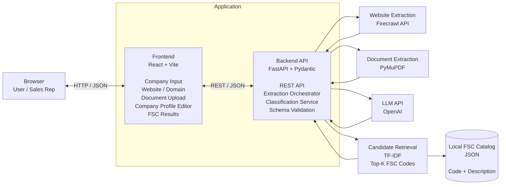

# FSC Code Classifier — Design Document

## 1. Overview

The FSC Code Classifier is a full-stack MVP that takes company information as input and recommends the Federal Supply Classification (FSC) codes that best describe what the company sells or provides.

The application accepts heterogeneous company inputs such as:

- Company name
- Website URL
- Email domain
- Uploaded PDF or capability statement
- Additional free-form company information

The core problem is not simply prompt generation. It is an information retrieval and controlled classification problem:

1. Collect evidence about what the company actually does.
2. Normalize that evidence into a structured company profile.
3. Retrieve relevant candidate FSC codes from the official FSC catalog.
4. Use an LLM to rerank those candidates.
5. Validate every final code deterministically before returning it to the user.

The design intentionally prioritizes a reliable working MVP over production infrastructure.

---

## 2. Goals

The system should:

- Accept company information from websites, documents, and manual input.
- Extract meaningful products, services, capabilities, materials, industries, and keywords.
- Recommend relevant 4-digit FSC codes.
- Avoid allowing the LLM to invent FSC codes from memory.
- Explain why each FSC code was recommended.
- Support user edits and reclassification.
- Handle API and extraction failures without crashing.
- Work for unseen companies without company-specific hardcoded mappings.

---

## 3. Non-Goals for the MVP

The following are intentionally excluded from the time-boxed MVP:

- PostgreSQL persistence
- Redis or caching infrastructure
- Authentication and authorization
- Background workers or queues
- Observability infrastructure
- Vector databases
- Microservices
- Full website crawling
- Historical classification management

The application remains stateless so implementation time can focus on extraction quality, retrieval, ranking, validation, and explainability.

---

# 4. Architecture

## 4.1 Tech Stack

| Layer | Technology | Responsibility |
|---|---|---|
| Frontend | React.js, TypeScript, Vite, Tailwind CSS | Company input, document upload, editable company profile, FSC recommendations |
| Backend | Python, FastAPI, Pydantic | REST API, orchestration, validation, business logic |
| Website Extraction | Firecrawl API | Extract useful company website content |
| PDF Extraction | PyMuPDF | Extract uploaded PDF text |
| LLM | OpenAI API | Company profile extraction and FSC candidate reranking |
| Candidate Retrieval | scikit-learn TF-IDF | Retrieve relevant FSC candidates from the local catalog |
| FSC Reference | Local JSON | Canonical 4-digit FSC code and description catalog |
| Testing | Pytest | API, extraction, retrieval, validation, and failure-path tests |

---

## 4.2 High-Level Architecture



---

## 4.3 Core Pipeline

```text
Company Input
      ↓
Source Acquisition
      ↓
Website / PDF Text Normalization
      ↓
Company Feature Extraction
      ↓
Structured CompanyProfile
      ↓
Local FSC Candidate Retrieval
      ↓
Top FSC Candidates
      ↓
LLM Reranking
      ↓
FSC Catalog Validation
      ↓
Top FSC Recommendations + Evidence
```

A key design principle is:

> The LLM does not generate FSC codes freely from memory.

Instead:

1. The LLM extracts a structured understanding of the company.
2. The backend retrieves candidate codes from the official FSC catalog.
3. The LLM only reranks or selects from those candidates.
4. The backend validates the final codes against the catalog.

This reduces hallucination risk and keeps the final output grounded in a controlled taxonomy.

---

# 5. Happy Path

```text
User enters company name
        ↓
Adds website URL / email domain / PDF
        ↓
Validate input
        ↓
Extract website and document content
        ↓
Normalize and deduplicate source text
        ↓
LLM extracts structured company capabilities
        ↓
Validate CompanyProfile schema
        ↓
TF-IDF searches FSC catalog
        ↓
Retrieve top candidate FSC codes
        ↓
LLM reranks candidates
        ↓
Validate every returned FSC code against catalog
        ↓
Display extracted company profile
        ↓
Display ranked FSC recommendations
        ↓
User may edit company profile
        ↓
Re-classify FSC codes
```

---

# 6. Edge Cases

## 6.1 Empty Input

```text
Empty company input
→ Analysis blocked
→ Validation error displayed
```

## 6.2 Website Extraction Failure

```text
Website timeout / anti-bot / extraction failure
→ Warning displayed
→ Continue using uploaded documents or other available sources
```

## 6.3 PDF Extraction Failure

```text
PDF extraction failure
→ Warning displayed
→ Continue using website or manual input
```

## 6.4 Low-Information Website

```text
Website extraction succeeds but contains little useful information
→ Build profile from available evidence
→ Display low-information warning
```

## 6.5 LLM API Failure

```text
LLM API failure
→ API returns controlled error
→ Extracted source content remains available
→ User can retry
```

## 6.6 Invalid LLM Output

```text
LLM returns malformed structured output
→ Pydantic schema validation fails
→ One controlled retry is allowed
→ Invalid result is never sent to the frontend
```

## 6.7 Hallucinated FSC Code

```text
LLM returns an invalid or nonexistent FSC code
→ Backend validates against local FSC catalog
→ Invalid code is removed
```

## 6.8 Duplicate FSC Codes

```text
Duplicate recommendations
→ Deduplicate before response
```

## 6.9 No Strong Match

```text
No strong FSC match
→ Do not invent a code
→ Return no strong match or low-confidence recommendations
```

## 6.10 Edited Company Profile

```text
User edits extracted company capabilities
→ POST /api/classify
→ FSC rankings are regenerated
```

## 6.11 Unseen Demo Company

```text
Previously unseen fourth company
→ Same generic pipeline
→ No company-specific hardcoded mappings
```

---

# 7. Acceptance Criteria

The application is considered acceptable if all of the following pass:

1. User can enter a company name.
2. User can provide a website URL and/or email domain.
3. User can upload a PDF capability statement.
4. The backend can extract usable text from a website.
5. The backend can extract usable text from a PDF.
6. The system converts source content into a structured company profile.
7. Extracted company features are displayed to the user.
8. The user can edit extracted company features before reclassification.
9. The system retrieves FSC candidates from the official local FSC catalog.
10. Every recommended FSC code is exactly four digits and exists in the FSC reference catalog.
11. FSC recommendations include the official FSC description.
12. Recommendations include evidence or rationale showing why the company matches the code.
13. Website extraction failure does not crash the application.
14. Document extraction failure does not crash the application.
15. LLM failure does not crash the application.
16. Invalid LLM output does not reach the frontend.
17. Duplicate FSC recommendations are removed.
18. The classification pipeline works for an unseen company and does not use company-specific hardcoded mappings.
19. Backend tests can run without real OpenAI or Firecrawl calls by mocking external APIs.
20. The full happy path works from the browser on localhost.

---

# 8. Data Models

## 8.1 CompanyInput

```ts
type CompanyInput = {
  companyName: string;
  websiteUrl: string | null;
  emailDomain: string | null;
  additionalText: string | null;
};
```

Uploaded documents are sent separately using multipart form data.

---

## 8.2 CompanyProfile

`CompanyProfile` is a transient API schema produced from website content, uploaded documents, and manual input.

```ts
type CompanyProfile = {
  companyName: string;
  summary: string;

  products: string[];
  services: string[];
  capabilities: string[];
  materials: string[];
  industries: string[];
  keywords: string[];
};
```

Example:

```json
{
  "companyName": "Lone Star Downhole Products",
  "summary": "Precision manufacturing company providing CNC machining and related manufacturing services.",
  "products": [
    "precision-machined components"
  ],
  "services": [
    "CNC machining",
    "rubber molding",
    "fabrication",
    "laser engraving"
  ],
  "capabilities": [
    "multi-axis CNC machining",
    "welding",
    "prototype development",
    "full-scale production"
  ],
  "materials": [],
  "industries": [
    "industrial manufacturing"
  ],
  "keywords": [
    "machining",
    "fabrication",
    "precision components"
  ]
}
```

---

## 8.3 SourceEvidence

```ts
type SourceEvidence = {
  sourceType: "website" | "document" | "manual";
  sourceName: string;
  text: string;
};
```

Example:

```json
{
  "sourceType": "document",
  "sourceName": "LSDP Capabilities Statement.pdf",
  "text": "In-House Services Include CNC Machining, Rubber Molding, Fabrication..."
}
```

---

## 8.4 FSCRecord

The canonical local FSC catalog record.

```ts
type FSCRecord = {
  code: string;
  description: string;
};
```

Example:

```json
{
  "code": "3416",
  "description": "Lathes"
}
```

---

## 8.5 FSCRecommendation

```ts
type FSCRecommendation = {
  code: string;
  description: string;
  score: number;
  rationale: string;
  evidence: string[];
};
```

Example:

```json
{
  "code": "XXXX",
  "description": "Official FSC description",
  "score": 0.91,
  "rationale": "The company manufactures precision-machined components using CNC machining.",
  "evidence": [
    "CNC Machining",
    "precision-machined components"
  ]
}
```

The MVP treats `score` as a ranking signal rather than a calibrated probability.

---

## 8.6 CompanyAnalysis

```ts
type CompanyAnalysis = {
  profile: CompanyProfile;
  recommendations: FSCRecommendation[];
  sources: SourceEvidence[];
  warnings: string[];
};
```

---

# 9. Current Design Decisions

## 9.1 CompanyProfile Is Transient

`CompanyProfile` is not persisted.

```text
Website
PDF
Manual company information
        ↓
LLM extraction
        ↓
CompanyProfile
```

It exists only for the current analysis and can be edited before reclassification.

---

## 9.2 FSCRecommendation Is Transient

```text
CompanyProfile
      ↓
Candidate Retrieval
      ↓
LLM Reranking
      ↓
Catalog Validation
      ↓
FSCRecommendation[]
```

Recommendations are generated on demand.

---

## 9.3 FSC Catalog Is Local

The official FSC reference should be converted once into:

```text
backend/app/data/fsc_codes.json
```

Runtime classification should not depend on the DLA website being available.

---

## 9.4 No Database in the MVP

The assignment focuses on classification, not persistence.

The MVP intentionally excludes:

```text
PostgreSQL      ✕
Redis           ✕
Authentication  ✕
Observability   ✕
Vector Database ✕
```

This is a deliberate time-boxed tradeoff.

If the application becomes a production feature, classification history, user corrections, and feedback can later be persisted without changing the core classification pipeline.

---

# 10. Classification Strategy

## 10.1 Stage 1 — Evidence Collection

### Website

Use Firecrawl to extract a small number of relevant pages.

Preferred paths include:

```text
/
 /about
 /products
 /services
 /capabilities
```

The crawl should remain shallow, for example a maximum of approximately five useful pages.

This prevents large websites from increasing latency and token usage unnecessarily.

### Documents

Use PyMuPDF to extract text from uploaded PDFs.

Manual user-provided text is also treated as a source.

---

## 10.2 Stage 2 — Structured Company Extraction

Normalized source content is sent to the LLM with strict structured output requirements.

Expected schema:

```json
{
  "summary": "...",
  "products": [],
  "services": [],
  "capabilities": [],
  "materials": [],
  "industries": [],
  "keywords": []
}
```

The result must pass Pydantic validation before continuing.

---

## 10.3 Stage 3 — Candidate Retrieval

The following CompanyProfile fields are combined into a retrieval query:

```text
products
services
capabilities
materials
industries
keywords
```

Example:

```text
precision machined components
CNC machining
rubber molding
fabrication
industrial manufacturing
```

The backend runs TF-IDF retrieval against FSC descriptions and returns approximately the top 20 candidate FSC records.

This narrows the search space before the LLM ranking stage.

---

## 10.4 Stage 4 — LLM Reranking

The LLM receives only:

```text
CompanyProfile
+
Top FSC candidate records
```

The prompt must enforce:

```text
Select only FSC codes from the supplied candidates.

Do not generate FSC codes from memory.

Recommend only codes directly supported by the company's
products, services, or capabilities.

Return evidence from the supplied company profile.
```

The model returns approximately the top 3–5 strongest recommendations.

---

## 10.5 Stage 5 — Deterministic Validation

Every recommendation must pass backend validation.

```python
len(code) == 4
code.isdigit()
code in fsc_catalog
```

The backend must also:

```python
deduplicate(codes)
```

Descriptions must be loaded from the local FSC catalog rather than trusted from the LLM output.

Only validated recommendations are returned to the frontend.

---

# 11. API Endpoints

## 11.1 Health Check

```http
GET /health
```

Response:

```json
{
  "status": "ok"
}
```

---

## 11.2 Analyze Company

```http
POST /api/analyze
Content-Type: multipart/form-data
```

Request fields:

```text
companyName
websiteUrl optional
emailDomain optional
additionalText optional
files optional
```

Example website-based request:

```text
companyName=LOOS & CO INC
websiteUrl=https://loosco.com/
emailDomain=loosco.com
additionalText=
files=[]
```

Example document-based request:

```text
companyName=Lone Star Downhole Product
websiteUrl=
emailDomain=
files=[LSDP Capabilities Statement.pdf]
```

The endpoint performs:

```text
Source extraction
→ Source normalization
→ Company profile extraction
→ FSC candidate retrieval
→ LLM reranking
→ FSC validation
```

Example response:

```json
{
  "profile": {
    "companyName": "Example Company",
    "summary": "...",
    "products": [],
    "services": [],
    "capabilities": [],
    "materials": [],
    "industries": [],
    "keywords": []
  },
  "recommendations": [
    {
      "code": "XXXX",
      "description": "...",
      "score": 0.91,
      "rationale": "...",
      "evidence": [
        "..."
      ]
    }
  ],
  "sources": [],
  "warnings": []
}
```

---

## 11.3 Re-Classify Company

```http
POST /api/classify
```

This endpoint accepts an edited `CompanyProfile`.

Example request:

```json
{
  "companyName": "Example Manufacturing",
  "summary": "...",
  "products": [
    "aircraft cable assemblies"
  ],
  "services": [],
  "capabilities": [
    "wire rope manufacturing"
  ],
  "materials": [
    "stainless steel"
  ],
  "industries": [
    "aerospace"
  ],
  "keywords": [
    "aircraft cable",
    "wire rope"
  ]
}
```

The endpoint reruns:

```text
Candidate Retrieval
→ LLM Reranking
→ FSC Validation
```

Example response:

```json
{
  "recommendations": [
    {
      "code": "XXXX",
      "description": "...",
      "score": 0.94,
      "rationale": "...",
      "evidence": [
        "aircraft cable assemblies",
        "wire rope manufacturing"
      ]
    }
  ]
}
```

---

## 11.4 Get FSC Record

Optional endpoint:

```http
GET /api/fsc/{code}
```

Response:

```json
{
  "code": "XXXX",
  "description": "..."
}
```

---

# 12. Frontend Workflow

The frontend should remain a single-page application.

```text
------------------------------------------------------------

FSC Code Classifier

[ Company Name                                      ]

[ Website URL                                       ]

[ Email Domain                                      ]

[ Drag or upload capability statement               ]

[ Additional company information                    ]

                        [ Analyze Company ]

------------------------------------------------------------

Company Profile

Summary
...

Products
[ Cable Assemblies ] [ Wire Rope ]

Services
[ CNC Machining ]

Capabilities
[ Precision Manufacturing ]

                         [ Edit ] [ Re-classify ]

------------------------------------------------------------

Recommended FSC Codes

3040
Miscellaneous Power Transmission Equipment
92% match

Why
...

Evidence
"wire rope..."
"cable assemblies..."

------------------------------------------------------------

4010
Chain and Wire Rope
88% match

...

------------------------------------------------------------
```

The key UX principle is evidence-driven recommendations.

Even though the assignment only requires outputting 4-digit codes, showing official descriptions, rationale, and evidence makes the classification process more transparent and easier to evaluate during the demo.

---

# 13. Frontend Prompt for Lovable

```text
Build a frontend-only MVP called “FSC Code Classifier” for an internal government-contracting sales tool.

Use a clean, modern enterprise SaaS style. Prioritize clarity and density over decorative design.

Stack:
React.js
TypeScript
Vite
Tailwind CSS

I will build the Python/FastAPI backend separately.
Do not implement backend logic, authentication, database, or external API calls.
Use mocked data only.

Create a single-page application.

Top section:
Company Information

Fields:
1. Company Name — required
2. Website URL — optional
3. Email Domain — optional
4. Additional Company Information — optional multiline textarea
5. PDF/document upload drag-and-drop area

Primary action:
Analyze Company

Show a realistic loading state while analyzing:
“Collecting company information”
“Extracting capabilities”
“Matching FSC codes”

After analysis, display two sections.

Section 1: Extracted Company Profile

Show:
Summary
Products
Services
Capabilities
Materials
Industries
Keywords

Products, services, capabilities, materials, industries and keywords should appear as editable chips/tags.

Include:
Edit Profile
Re-classify

Section 2: Recommended FSC Codes

Each recommendation should be shown as a card containing:

4-digit FSC code prominently
Official FSC description
Match score
Short rationale
Supporting evidence chips / quotes

Show 3–5 recommendations.

Also implement frontend states for:

Empty input validation
Website extraction warning
Document extraction warning
Analysis failure
No strong FSC match
Successful result

Use mocked data that demonstrates the UI but do not hardcode company-specific behavior.

Keep everything on one page.
Do not create authentication, dashboards, settings, analytics, inboxes, or unrelated pages.

The frontend will later call:

POST /api/analyze
POST /api/classify
GET /health

Design the components so mocked API calls can easily be replaced with real fetch calls later.
```

---

# 14. Backend Prompt for Codex

```text
Inspect the existing frontend first.

This is a timed full-stack interview assignment.
The React/Vite frontend was generated first using mocked data.
We now need to replace the mocked FSC classifier behavior with a real Python backend.

Do not redesign the frontend unless integration requires a small change.

Stack:

Frontend:
React
TypeScript
Vite
Tailwind CSS

Backend:
Python
FastAPI
Pydantic
Pytest

External services:
OpenAI API
Firecrawl API

Document parsing:
PyMuPDF

FSC candidate retrieval:
scikit-learn TF-IDF

FSC reference:
Local JSON file generated from the official Federal Supply Classification reference.

Do NOT add:

PostgreSQL
Redis
vector database
authentication
observability infrastructure
background queues
microservices

This is intentionally a stateless MVP.

Architecture:

Company name / website / email domain / uploaded documents
→ source extraction
→ normalized company information
→ LLM structured CompanyProfile extraction
→ local FSC candidate retrieval
→ LLM reranking
→ deterministic FSC validation
→ frontend recommendations

Important design requirement:

The LLM must NOT freely invent FSC codes from memory.

The backend must first retrieve candidate FSC codes from the local official FSC catalog.

The LLM should only rerank/select from those candidates.

Every returned FSC code must then be validated against the local FSC catalog before being returned to the frontend.

Create these schemas:

CompanyProfile

{
  companyName: string,
  summary: string,
  products: string[],
  services: string[],
  capabilities: string[],
  materials: string[],
  industries: string[],
  keywords: string[]
}

SourceEvidence

{
  sourceType: "website" | "document" | "manual",
  sourceName: string,
  text: string
}

FSCRecord

{
  code: string,
  description: string
}

FSCRecommendation

{
  code: string,
  description: string,
  score: number,
  rationale: string,
  evidence: string[]
}

CompanyAnalysis

{
  profile: CompanyProfile,
  recommendations: FSCRecommendation[],
  sources: SourceEvidence[],
  warnings: string[]
}

Endpoints:

GET /health

POST /api/analyze

multipart/form-data fields:

companyName
websiteUrl optional
emailDomain optional
additionalText optional
files optional

/api/analyze should:

1. validate input

2. use Firecrawl to extract useful website content if websiteUrl exists

Prefer content from:
homepage
about
products
services
capabilities

Limit crawling to a small number of relevant pages so the application stays fast.

3. use PyMuPDF to extract text from uploaded PDFs

4. normalize and deduplicate source content

5. use OpenAI structured output to generate CompanyProfile

6. validate CompanyProfile using Pydantic

7. build a search query from:
products
services
capabilities
materials
industries
keywords

8. use TF-IDF against the local FSC catalog to retrieve approximately the top 20 FSC candidates

9. send CompanyProfile and ONLY those candidate FSC records to OpenAI for reranking

10. return approximately the top 3–5 strongest recommendations

11. validate every recommendation before returning it:

code must contain exactly 4 digits
code must exist in the FSC catalog
description must come from the local FSC catalog
duplicates must be removed

POST /api/classify

Accept an edited CompanyProfile.

Run candidate retrieval, reranking and validation again.

Return FSC recommendations.

GET /api/fsc/{code} is optional if trivial to implement.

Environment variables:

OPENAI_API_KEY
FIRECRAWL_API_KEY
OPENAI_MODEL
VITE_API_BASE_URL

Do not hardcode API keys.

FSC catalog:

Use the official FSC reference supplied by the assignment.

Create:

backend/app/data/fsc_codes.json

Runtime classification must not depend on downloading the DLA website.

If the FSC source needs conversion, add a small script under scripts/ to convert/download it once, but the application itself should use the local JSON catalog.

Keep the implementation simple and readable.

Do not build abstractions that are unnecessary for this MVP.

--------------------------------------------------

TESTS FIRST

Before implementing backend behavior, write Pytest tests based on these acceptance criteria:

1. User can enter a company name.
2. User can provide a website URL and/or email domain.
3. User can upload a PDF capability statement.
4. Website content can be converted into usable text.
5. PDF content can be converted into usable text.
6. Source content can be converted into a structured CompanyProfile.
7. The API returns extracted company features.
8. An edited CompanyProfile can be reclassified.
9. Candidate FSC codes are retrieved from the local FSC catalog.
10. Every returned FSC code is exactly four digits.
11. Every returned FSC code exists in the official local catalog.
12. FSC descriptions come from the catalog.
13. Recommendations contain rationale and evidence.
14. Website extraction failure does not crash the application.
15. PDF extraction failure does not crash the application.
16. LLM failure returns a controlled API error.
17. Invalid LLM structured output does not reach the frontend.
18. Invalid or hallucinated FSC codes are filtered.
19. Duplicate FSC recommendations are removed.
20. The pipeline does not contain hardcoded mappings for the supplied sample companies.

Mock OpenAI and Firecrawl in automated tests.

Tests must not require paid API requests.

--------------------------------------------------

ERROR HANDLING

If website extraction fails but another source exists:
continue analysis and include a warning.

If one PDF fails but another source exists:
continue analysis and include a warning.

If no usable source exists:
return a clear validation error.

If OpenAI fails:
return a controlled API error.

If OpenAI returns malformed structured data:
handle the schema error safely.

A single controlled retry for malformed LLM output is acceptable.

Do not silently invent missing company information.

--------------------------------------------------

FRONTEND INTEGRATION

Replace mocked frontend calls with the real backend.

The existing UI should support:

Company name
Website URL
Email domain
Additional text
Document upload

Analyze Company

Extracted Company Profile

Editable profile fields

Re-classify

Recommended FSC cards containing:

code
description
score
rationale
evidence

Show clear loading, warning and error states.

--------------------------------------------------

TEST DATA

Validate the implementation using the supplied test companies:

H & R PARTS CO INC
https://www.hrpartsco.com/

LOOS & CO INC
https://loosco.com/

Lone Star Downhole Product
using the provided LSDP Capabilities Statement PDF

Do NOT create special-case mappings for these companies.

The system must use the same generic pipeline for all companies because a fourth unseen company will be provided during the live demo.

--------------------------------------------------

IMPLEMENTATION PROCESS

Work step by step.

Commit after each meaningful implementation milestone.

Recommended commits:

1. tests and backend skeleton
2. source extraction
3. company profile extraction
4. FSC retrieval and ranking
5. frontend integration
6. error handling and final tests
7. README

Run the full automated test suite and make sure all tests pass.

Then start the frontend and backend locally.

Use Computer Use to verify the happy path and major edge cases in the actual localhost UI.

Verify at least:

website-based classification
PDF-based classification
profile editing and reclassification
website extraction failure
LLM/API error UI
empty form validation

Fix any integration problems you discover.

Finally push all commits to the existing remote repository.

Write a thorough README.md containing:

Project overview
Architecture
Why the classifier uses retrieval + LLM reranking
Tech stack
Environment variables
How to install
How to run backend
How to run frontend
How to run tests
API endpoints
Error handling
Known MVP limitations
Future improvements

Also include a short section explaining these intentional time-boxed tradeoffs:

No database
No authentication
No vector database
Limited website crawl depth
TF-IDF retrieval instead of a larger search infrastructure

The README should emphasize that the architecture is designed so those pieces can be added later without changing the core classification pipeline.
```

---

# 15. Suggested Repository Structure

```text
fsc-classifier/
│
├── frontend/
│   ├── src/
│   │   ├── components/
│   │   ├── api/
│   │   ├── types/
│   │   └── App.tsx
│   └── package.json
│
├── backend/
│   ├── app/
│   │   ├── main.py
│   │   ├── schemas.py
│   │   │
│   │   ├── services/
│   │   │   ├── website_extractor.py
│   │   │   ├── document_extractor.py
│   │   │   ├── profile_extractor.py
│   │   │   ├── fsc_retriever.py
│   │   │   └── fsc_ranker.py
│   │   │
│   │   └── data/
│   │       └── fsc_codes.json
│   │
│   ├── tests/
│   │   ├── test_analyze.py
│   │   ├── test_classify.py
│   │   ├── test_fsc_validation.py
│   │   └── fixtures/
│   │
│   └── requirements.txt
│
├── scripts/
│   └── build_fsc_catalog.py
│
├── test-data/
│   └── LSDP Capabilites Statement.pdf
│
├── .env.example
├── README.md
├── design_doc.md
└── .gitignore
```

---

# 16. Demo Walkthrough

The demo should focus on the classification architecture rather than the frontend framework.

A concise explanation:

> I treated this as an information retrieval and classification problem rather than only an LLM prompting problem. The first challenge is understanding what a company actually sells from heterogeneous sources such as websites and capability statements. The second challenge is mapping that evidence to a controlled FSC taxonomy without hallucinating codes.

Then explain the two-stage AI flow:

> The first LLM stage converts raw website and document evidence into a normalized company profile. I then use deterministic retrieval against the official FSC catalog to narrow the search space. The second LLM stage only reranks those candidates, and the backend validates every final code against the catalog before returning it.

Finally, explain the MVP tradeoff:

> Persistence is not part of the core classification problem, so I intentionally kept the MVP stateless and spent the time on extraction quality, retrieval, validation, failure handling, and explainability. If this became a production SalesPatriot feature, classification history and user corrections could become persisted feedback data without changing the core classification pipeline.
